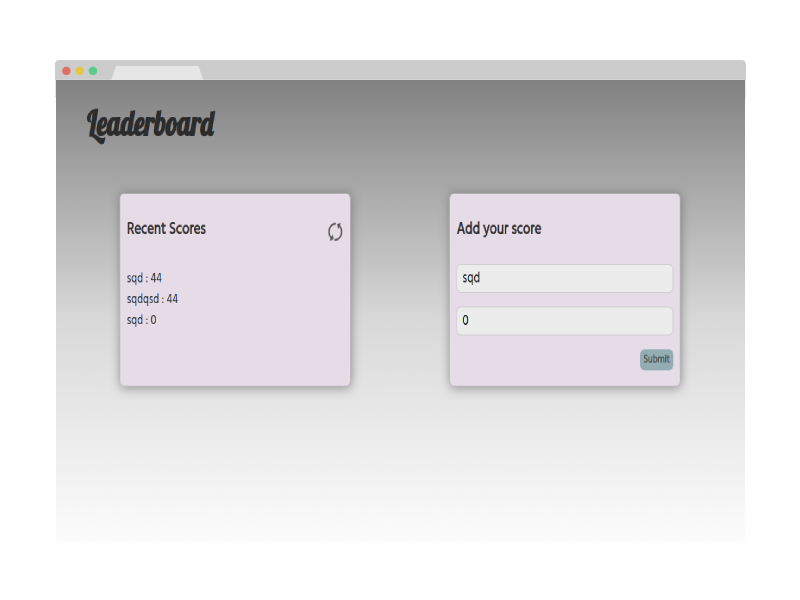

# Project Name

> Leaderboard

This Website is a Leaderboard listing project. A simple as it seems, it displays scores submitted by different players. It also allows you to submit your score. All data is preserved thanks to the external Leaderboard API service.

## Built With

- HTML, CSS, JavaScript
- Webpack
- VS Code

## Live Demo

[Live Demo Link]()

## Getting Started

To get a local copy up and running follow these simple example steps.

### Prerequisites

- VSCODE / Live HTTP Server (./dist)

- OS with Git installed on it

### Setup

**Run** git clone https://github.com/AmineHLub/Leaderboard.git

**Test**
npm i jest

### Test
npm run test 

## Authors

👤 **Author1**

- GitHub: [@AmineHLub](https://github.com/AmineHLub)
- Twitter: [@Amino47612441](https://twitter.com/Amino47612441)
- LinkedIn: [LinkedIn](https://www.linkedin.com/in/mohamed-amine-hajltaief-b18863163/)

## 🤝 Contributing

Any contributing is welcome

Feel free to check the [issues page](https://github.com/AmineHLub/Leaderboard/issues).

## Show your support

Give a ⭐️ if you like this project!

## Acknowledgments

- This project belongs to [Microverse](https://microverse.org/).

## 📝 License

- This project is [MIT](./Licenses/MIT.md) licensed.
